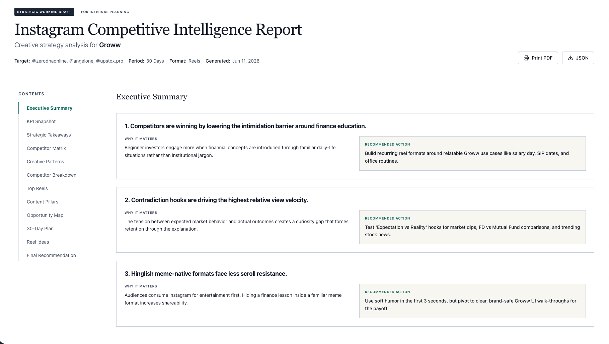
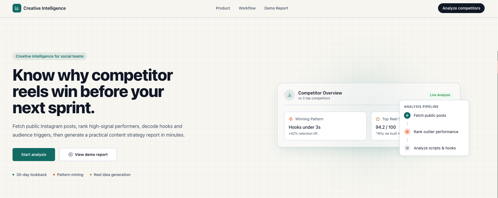
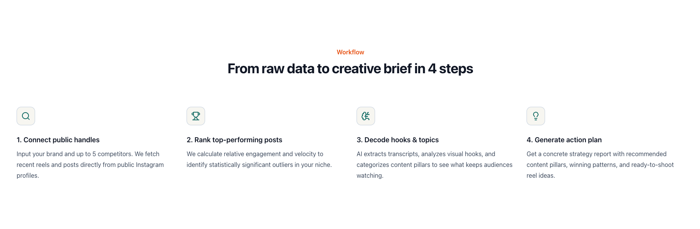
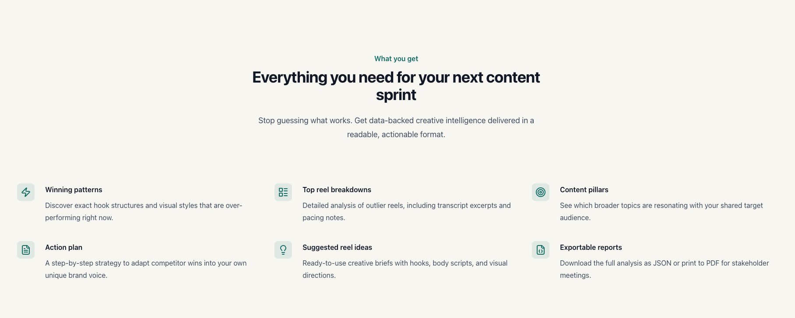

# Instagram Creative Intelligence Analyzer

A Next.js application for analyzing public Instagram accounts, ranking their best-performing posts, extracting creative evidence from videos, and turning the results into a strategy report.

The core idea is simple:

```txt
Find what is working on Instagram.
Measure it before using AI.
Extract the creative evidence from the post.
Explain why it worked.
Turn the pattern into ideas the target account can adapt without copying.
```

The app is account-agnostic. It can be used for brands, creators, founder accounts, publishers, communities, product accounts, education pages, consumer businesses, or any other public Instagram account where public post data is available.

## Screenshots









## What This Project Does

- Accepts a target account context: account or brand name, handle, competitor/reference handles, content type, lookback window, date bounds, fetch count, analysis count, industry/category, audience, tone, and things to avoid.
- Scrapes public Instagram profile media through the active `InstagramWebScraper`.
- Downloads available reel/video files when Instagram exposes a playable video URL.
- Saves downloaded videos locally under `downloads/instagram/<username>/`.
- Scores posts with deterministic metrics before AI is used.
- Selects the strongest posts for deeper media and creative analysis.
- Uses `ffprobe` to inspect local video/audio duration.
- Uses `ffmpeg` to extract audio into `audio.wav`.
- Uses `ffmpeg` to take screenshots from videos every 5 seconds.
- Sends screenshots to the fast OpenAI model so it can describe what is visually happening in the reel.
- Sends extracted audio to the transcription model with a social-media-specific transcription prompt.
- Combines caption, metrics, transcript, frame descriptions, and comments/counts into structured post analysis.
- Aggregates cross-post creative patterns.
- Generates account-specific content ideas, action plans, and strategy recommendations.
- Saves every major pipeline stage as JSON for inspection/debugging.
- Renders a report UI with strategy sections, scorecards, patterns, opportunities, top reels, creative briefs, and recommendations.

## High-Level Architecture

```txt
Frontend form
  -> POST /api/analyze
  -> create in-memory job
  -> /jobs/:id subscribes to /api/jobs/:id/stream
  -> master agent runs the full analysis pipeline
  -> staged artifacts are saved to downloads/instagram/runs
  -> /reports/:id renders the final report
```

The main orchestration lives in:

```txt
__agents__/agent__master.ts
```

That master agent coordinates smaller agents:

```txt
agent__data__collection.ts
  Scrape Instagram public posts and download videos.

agent__scoring.ts
  Filter and score fetched posts using deterministic metrics.

agent__media__processing.ts
  Extract audio, sample frames, transcribe audio, and describe frames.

agent__creative__analysis.ts
  Run structured AI analysis for each selected post.

agent__pattern__aggregation.ts
  Find repeated creative patterns across analyzed posts.

agent__recommendation.ts
  Generate account-specific content ideas and action steps.
```

## End-to-End Pipeline

### 1. User Submits Analysis Context

The home page collects an `AnalysisInput` and posts it to:

```txt
POST /api/analyze
```

The route validates the request with `ANALYZE_INPUT_SCHEMA` from `config.ts`, creates an in-memory job, and returns a `jobId`.

Input shape:

```ts
type AnalysisInput = {
  brand: string;
  brandHandle: string;
  competitors: string[];
  platform: "Instagram";
  contentType: "reels" | "posts" | "both";
  lookbackDays: number;
  dateFrom?: string;
  dateTo?: string;
  postsToFetchPerCompetitor: number;
  topPostsToSelect: number;
  reelsToAnalyze: number;
  industry?: string;
  targetAudience?: string;
  brandTone?: string;
  brandAvoid?: string;
};
```

Despite the field name `competitors`, these accounts can also be reference accounts, creator accounts, inspiration pages, publishers, or adjacent category accounts.

### 2. Job Progress Streams Over SSE

The progress page connects to:

```txt
GET /api/jobs/:id/stream
```

That endpoint runs the job and streams `ProgressEvent` payloads over Server-Sent Events. The UI renders those events in `ProgressTimeline`.

### 3. Data Collection Agent Scrapes Instagram

The data collection agent calls the Instagram tool wrapper:

```txt
__tools__/tools__instagram.ts
```

That tool validates inputs with zod and calls:

```txt
scrapers/instagram-web-scraper.ts
```

The scraper:

1. Normalizes the handle or profile URL into a username.
2. Calls Instagram's public web profile endpoint:

```txt
https://www.instagram.com/api/v1/users/web_profile_info/
```

3. Reads public profile media nodes from `edge_owner_to_timeline_media`.
4. Filters media by `contentType`:
   - `reels`: only video media
   - `posts`: only non-video media
   - `both`: all supported media
5. Applies the lookback window and optional `dateFrom` / `dateTo` filters.
6. Extracts public metrics:
   - post id
   - shortcode
   - account handle
   - account display name
   - follower count
   - Instagram URL
   - thumbnail URL
   - video URL when available
   - caption
   - posted date
   - views or plays
   - likes
   - comment count
   - content type
7. Attempts to resolve a video URL for reels if the profile node does not expose one directly.

Video URL resolution tries:

```txt
i.instagram.com/api/v1/media/:mediaId/info/
https://www.instagram.com/reel/:shortcode/
https://www.instagram.com/p/:shortcode/
```

If a video URL is found and video downloading is enabled, the scraper downloads the MP4 with Node streams.

Downloaded video path:

```txt
downloads/instagram/<username>/<shortcode>.mp4
```

The raw scrape result is saved as:

```txt
downloads/instagram/runs/<runId>-run-1-raw.json
```

### 4. Scoring Agent Ranks Posts Before AI

The scoring agent runs before any expensive model analysis. This is intentional: the model should analyze posts that have evidence of performance, not random posts.

Scoring lives in:

```txt
lib/scoring.ts
```

For each account, the scorer first computes account baselines:

```txt
avgViews = total views for account / number of account posts
avgEngagement = average((likes + comments) / views)
```

Then each post gets raw metrics:

```txt
viewRate = views / followers
likeRate = likes / (views or followers)
commentRate = comments / (views or followers)
engagementRate = (likes + comments) / (views or followers)
velocityPerDay = views / days since posted
relativeViews = post views / account average views
relativeEngagement = post engagement rate / account average engagement rate
```

The scorer then min-max normalizes:

```txt
relativeViews
relativeEngagement
velocityPerDay
commentRate
likeRate
```

The final score is a weighted blend:

```txt
relativeViews:       0.35
relativeEngagement:  0.25
velocity:            0.20
commentRate:         0.12
likeRate:            0.08
```

In formula form:

```txt
finalScore =
  0.35 * normalizedRelativeViews +
  0.25 * normalizedRelativeEngagement +
  0.20 * normalizedVelocity +
  0.12 * normalizedCommentRate +
  0.08 * normalizedLikeRate
```

Why these metrics:

- `relativeViews` catches posts that overperform their own account baseline.
- `relativeEngagement` catches posts that generate more interaction quality than usual.
- `velocityPerDay` reduces the advantage of older posts that had more time to accumulate views.
- `commentRate` captures discussion and reaction strength.
- `likeRate` captures lightweight positive response.
- `viewRate` is kept as a useful context metric because it compares views to follower count.

The scorer also marks:

```txt
isTopPost = true for the top 20 posts by final score
isOutlier = true for the top 5 posts by relative views
```

Scored output is saved as:

```txt
downloads/instagram/runs/<runId>-run-2-scored.json
```

### 5. Post Selection Balances Accounts and Score

The master agent selects posts for deep analysis from the scored list.

Selection logic:

1. Take the best post from each fetched account first.
2. Fill remaining slots by final score.
3. Sort selected posts by `finalScore`.

The target count is:

```txt
min(scored.length, max(input.reelsToAnalyze, numberOfAccounts))
```

This keeps one large account from dominating the AI analysis set when several reference accounts were provided.

### 6. Media Processing Downloads, Extracts, and Samples Evidence

Media processing is handled by:

```txt
__agents__/agent__media__processing.ts
__tools__/tools__media_processor.ts
__tools__/tools__transcription.ts
__tools__/tools__frame__describer.ts
```

For each selected post, `processPostMedia` creates a run-specific media folder:

```txt
downloads/instagram/media/<runId>/<shortcode>/
```

If the post has no downloaded video, the app records an error and falls back to thumbnail/caption-only analysis.

If a video is available, the tool runs `ffprobe`:

```txt
ffprobe -v error -show_entries format=duration -of default=noprint_wrappers=1:nokey=1 <video>
```

That records local video duration metadata.

### 7. Audio Extraction and Transcription

The app extracts audio with `ffmpeg`:

```txt
ffmpeg -y -i <video.mp4> -vn -acodec pcm_s16le -ar 16000 -ac 1 audio.wav
```

Output:

```txt
downloads/instagram/media/<runId>/<shortcode>/audio.wav
```

Then `tools__transcription.ts` reads the WAV file into a `Blob` and sends it to the configured transcription model through:

```txt
__tools__/tools__openai.ts
```

The default transcription model comes from:

```txt
OPENAI_TRANSCRIBE_MODEL
```

Fallback default:

```txt
gpt-4o-transcribe
```

The transcription request includes a custom prompt from `TRANSCRIPTION_PROMPT` in `config.ts`. That prompt tells the model to:

- transcribe accurately for social media creative analysis
- preserve spoken words
- keep brand names, creator names, product names, handles, slang, Hinglish, Hindi, regional phrases, numbers, prices, percentages, and acronyms when audible
- avoid summarizing, rewriting, translating, or adding analysis
- avoid inventing missing context when audio is unclear

The transcript is saved into the media artifact and later embedded into the post analysis prompt.

If transcription fails, the app returns a fallback transcript object with the error message and continues the run.

### 8. Screenshot Extraction Every 5 Seconds

The app samples video frames with `ffmpeg`.

Config:

```txt
DEFAULT_FRAME_INTERVAL_SECONDS = 5
MAX_FRAMES_TO_EXTRACT = 20
MAX_FRAMES_TO_DESCRIBE = 20
```

Frame extraction command shape:

```txt
ffmpeg -y -i <video.mp4> -vf fps=1/5 -frames:v 20 frames/frame-%03d.jpg
```

Output:

```txt
downloads/instagram/media/<runId>/<shortcode>/frames/frame-001.jpg
downloads/instagram/media/<runId>/<shortcode>/frames/frame-002.jpg
...
```

This means the app attempts to capture one screenshot every 5 seconds, up to 20 screenshots per selected video.

### 9. Fast Model Describes Screenshots

Each sampled frame is sent to the fast OpenAI model through the structured JSON helper.

Default fast model:

```txt
OPENAI_FAST_MODEL
```

Fallback default:

```txt
gpt-5.4-mini
```

Frame description flow:

```txt
frame jpg -> base64 data URL -> prompt__frame__description.ts -> fast model -> { description }
```

The frame prompt asks the model to describe visible evidence:

- people
- setting
- on-screen text
- graphics
- objects
- layout
- editing style
- brand cues
- product cues
- actions happening in the frame

It explicitly tells the model not to infer strategy or performance at this stage. The goal is to create factual visual evidence that the later creative analysis agent can use.

Frame descriptions are stored inside each post's media artifact:

```ts
type FrameDescription = {
  framePath: string;
  timestampSeconds: number;
  description: string;
  model?: string;
  error?: string;
};
```

Media output is saved as:

```txt
downloads/instagram/runs/<runId>-run-3-media.json
```

### 10. Creative Analysis Agent Explains Each Post

Creative analysis is handled by:

```txt
__agents__/agent__creative__analysis.ts
__prompts__/prompt__post__analysis.ts
```

For each selected post, the agent sends:

- target account context
- source/reference account
- post metrics
- caption
- transcript text
- frame descriptions
- comments when available

It requests strict structured JSON matching `postAnalysisSchema`.

The resulting `PostAnalysis` includes:

```ts
type PostAnalysis = {
  topic: string;
  contentPillar: string;
  format: string;
  funnelStage: string;
  hookType: string;
  hookText: string;
  hookStrength: number;
  opening: string;
  middle: string;
  ending: string;
  pacing: string;
  visualStyle: string;
  primaryDriver: string;
  secondaryDriver: string;
  shareability: string;
  commentPattern: string;
  whyWorked: string;
  brandAdaptation: string;
  suggestedTitle: string;
  suggestedHook: string;
  transcriptAvailable: boolean;
  framesAnalyzed: number;
};
```

The post analysis prompt is designed to work for any account or niche. It asks for:

- the real audience problem, desire, belief, event, product moment, or curiosity gap
- the execution format
- hook mechanics
- narrative structure
- pacing and editing density
- visual style
- likely performance drivers
- share/save/comment reasons
- evidence-backed explanation of why the post worked
- uncertainty when transcript, frames, or comments are unavailable
- adaptation guidance for the target account

If model analysis fails for a post, the app uses `tools__fallback__analysis.ts` to produce a deterministic fallback from caption and public metrics.

AI post analysis output is saved as:

```txt
downloads/instagram/runs/<runId>-run-4-ai.json
```

### 11. Pattern Aggregation Agent Finds Repeatable Mechanics

Pattern aggregation is handled by:

```txt
__agents__/agent__pattern__aggregation.ts
__prompts__/prompt__pattern__aggregation.ts
```

The agent receives the analyzed posts and looks for repeated creative mechanisms rather than surface-level topics.

Examples of mechanisms:

- identity-based hooks
- tension or contradiction
- proof and authority
- novelty
- humor
- transformation
- utility
- cultural timing
- creator trust
- product demonstration
- relatable audience pain
- format-market fit

It returns:

```ts
type Pattern = {
  name: string;
  count: number;
  psychology: string;
  replicability: "High" | "Medium" | "Low";
};
```

It also returns `contentPillars`, which are broad strategic lanes the target account can reuse.

### 12. Recommendation Agent Creates Ideas and Action Plan

Recommendations are handled by:

```txt
__agents__/agent__recommendation.ts
__prompts__/prompt__recommendations.ts
```

The agent receives:

- winning patterns
- top post summaries
- source account evidence
- target account context

It returns `reelIdeas` and an `actionPlan`.

Each idea includes:

```ts
type ReelIdea = {
  title: string;
  inspiredBy: string;
  patternReused: string;
  format: string;
  duration: string;
  hook: string;
  structure: string;
  cta: string;
  brandNote: string;
};
```

The prompt explicitly tells the model not to copy source creative. It should reuse the underlying strategic pattern while changing:

- premise
- examples
- wording
- visuals
- pacing
- tone
- CTA
- production format

### 13. Final Report Is Built and Saved

The final report includes:

- input context
- run id
- artifact paths
- fetch errors
- competitor/reference account summaries
- top analyzed posts
- cross-post patterns
- content pillars
- content ideas
- action plan

Final report path:

```txt
downloads/instagram/runs/<runId>-run-5-report.json
```

The report page renders the result through components in:

```txt
components/report/
```

Current report sections include:

- report header
- table of contents
- executive summary
- metric scorecard
- strategic takeaways
- competitor matrix
- pattern library
- competitor breakdown cards
- top reels analysis table
- content pillar framework
- opportunity map
- action plan timeline
- creative brief cards
- final recommendation

Some higher-level report sections are generated from the saved report object through `lib/mock-strategy.ts`. The core analysis data still comes from the pipeline described above.

## Saved Files and Local Storage Layout

Generated files live under `downloads/`, which should remain ignored by git.

Run JSON files:

```txt
downloads/instagram/runs/<runId>-run-1-raw.json
downloads/instagram/runs/<runId>-run-2-scored.json
downloads/instagram/runs/<runId>-run-3-media.json
downloads/instagram/runs/<runId>-run-4-ai.json
downloads/instagram/runs/<runId>-run-5-report.json
```

Downloaded source videos:

```txt
downloads/instagram/<username>/<shortcode>.mp4
```

Per-run media artifacts:

```txt
downloads/instagram/media/<runId>/<shortcode>/audio.wav
downloads/instagram/media/<runId>/<shortcode>/frames/frame-001.jpg
downloads/instagram/media/<runId>/<shortcode>/frames/frame-002.jpg
```

## Project Structure

```txt
app/
  page.tsx                         Analyzer landing/setup page
  jobs/[id]/page.tsx               Live SSE progress page
  reports/[id]/page.tsx            Report dashboard
  api/analyze/route.ts             Validates input and creates jobs
  api/jobs/[id]/route.ts           Reads job state
  api/jobs/[id]/stream/route.ts    Runs job and streams progress
  api/reports/[id]/route.ts        Returns report JSON
  api/reports/[id]/export/route.ts Downloads report JSON

components/
  AnalyzerForm.tsx                 Analyzer setup form
  ProgressTimeline.tsx             Job progress UI
  TopPostsTable.tsx                Top-post table and transcript modal
  report/                          Strategy report sections

__agents__/
  agent__master.ts                 Pipeline orchestrator
  agent__data__collection.ts       Instagram scraping stage
  agent__scoring.ts                Deterministic ranking stage
  agent__media__processing.ts      Audio/frame extraction and media enrichment
  agent__creative__analysis.ts     Per-post structured analysis
  agent__pattern__aggregation.ts   Cross-post pattern synthesis
  agent__recommendation.ts         Ideas and action plan

__tools__/
  tools__instagram.ts              Instagram fetch tool definition and zod contract
  tools__media_processor.ts        ffmpeg/ffprobe media processing
  tools__transcription.ts          Audio file to transcript wrapper
  tools__frame__describer.ts       Fast model frame description helper
  tools__openai.ts                 OpenAI Responses and transcription clients
  tools__fallback__analysis.ts     Deterministic fallback analysis
  tools__logger.ts                 pino logger

__prompts__/
  prompt__post__analysis.ts        Per-post analysis prompt and schema
  prompt__frame__description.ts    Frame description prompt and schema
  prompt__pattern__aggregation.ts  Pattern aggregation prompt and schema
  prompt__recommendations.ts       Recommendation prompt and schema

lib/
  jobs.ts                          In-memory job store
  report.ts                        Thin master-agent wrapper
  run-storage.ts                   JSON artifact writer
  scoring.ts                       Deterministic scoring math
  mock-strategy.ts                 Derived report-page strategy sections
  types.ts                         Compatibility type re-export

scrapers/
  base-scraper.interface.ts        Scraper contract
  instagram-web-scraper.ts         Active public Instagram scraper
  meta-ads-scraper.ts              Placeholder for future paid-ad source

config.ts                          App constants, model defaults, prompts, schemas
declaration.ts                     Shared TypeScript declarations
fetcherUtils.ts                    Shared handle/error/wait helpers
```

## Routes

```txt
POST /api/analyze
  Validates request body and creates a job.

GET /api/jobs/:id
  Returns job status.

GET /api/jobs/:id/stream
  Runs the analysis and streams progress events over SSE.

GET /api/reports/:id
  Returns report JSON. If the job exists but has no report yet, it completes the job.

GET /api/reports/:id/export
  Downloads report JSON.

GET /api/posts/:id/analysis
  Returns analysis for a post from the demo report path.

GET /api/competitors/:id/posts
  Returns posts for an account from the demo report path.
```

## Models and AI Responsibilities

The project uses three model roles:

```txt
OPENAI_REASONING_MODEL
  Used for structured creative analysis, pattern aggregation, and recommendations.

OPENAI_FAST_MODEL
  Used for screenshot/frame descriptions.

OPENAI_TRANSCRIBE_MODEL
  Used for audio transcription.
```

Defaults are defined in `config.ts`:

```txt
DEFAULT_OPENAI_REASONING_MODEL = gpt-5.5
DEFAULT_OPENAI_FAST_MODEL = gpt-5.4-mini
DEFAULT_OPENAI_TRANSCRIBE_MODEL = gpt-4o-transcribe
```

The OpenAI Responses calls use strict JSON schemas where applicable. The transcription call uses the audio transcription endpoint with the custom `TRANSCRIPTION_PROMPT`.

## Requirements

- Node.js 20+
- npm
- `ffmpeg` and `ffprobe` on `PATH`
- OpenAI API key

Check media tools:

```bash
ffmpeg -version
ffprobe -version
```

Install on macOS:

```bash
brew install ffmpeg
```

## Environment Variables

Create `.env.local`:

```bash
OPENAI_API_KEY=your_api_key_here
OPENAI_REASONING_MODEL=gpt-5.5
OPENAI_FAST_MODEL=gpt-5.4-mini
OPENAI_TRANSCRIBE_MODEL=gpt-4o-transcribe
```

Optional:

```bash
IG_SESSIONID=your_instagram_sessionid
LOG_LEVEL=info
```

`IG_SESSIONID` can help when Instagram rate-limits anonymous public requests or hides video URLs. Do not commit `.env.local`.

## Run Locally

```bash
npm install
npm run dev
```

Open:

```txt
http://localhost:3000
```

Run checks:

```bash
npm run typecheck
npm run lint
npm run build
```

## Standalone Instagram Fetch Script

The repo includes a standalone fetch script for quick scraper validation:

```bash
npm run play
```

Examples:

```bash
node scripts/fetch-instagram-posts.mjs https://www.instagram.com/groww_official/ --limit 5
node scripts/fetch-instagram-posts.mjs @upstox.pro --limit 10
node scripts/fetch-instagram-posts.mjs @zerodhaonline --limit 5 --no-download
```

It saves:

```txt
downloads/instagram/<username>/last-5-posts.json
downloads/instagram/<username>/<shortcode>.mp4
```

Use this script when you want to confirm whether Instagram currently exposes public post/video data for a specific account before running the full analyzer.

## Development Workflow

Recommended checks before opening a PR:

```bash
npm run typecheck
npm run lint
npm run build
```

Useful files to inspect when changing pipeline behavior:

```txt
__agents__/agent__master.ts
lib/scoring.ts
scrapers/instagram-web-scraper.ts
__tools__/tools__media_processor.ts
__tools__/tools__openai.ts
__prompts__/prompt__post__analysis.ts
```

## Limitations

- Instagram public endpoints can change, rate-limit, or omit fields.
- Private metrics are not available, including reach, saves, shares, watch time, retention, demographics, and audience breakdowns.
- Some reels may not expose a downloadable video URL.
- If Instagram returns a partial video stream, transcription and frame analysis only cover the downloaded local file.
- Comments are not deeply fetched yet; the scraper reliably captures comment counts.
- Jobs are stored in memory, so server restarts lose active job state.
- Saved JSON artifacts remain on disk, but the app does not yet provide a full report-history browser.
- This is a local analysis tool. Production usage needs legal review, durable storage, retry policy, queueing, monitoring, and an approved data source.
